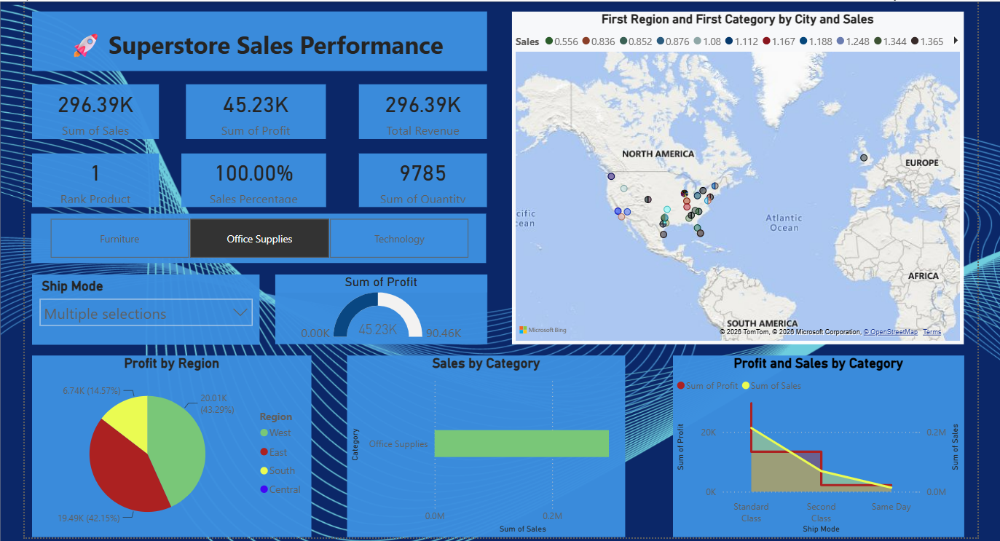

# Superstore Sales Performance Dashboard – Power BI

An interactive Power BI dashboard developed to analyze Superstore sales and profit performance.

## 📊 Project Overview

This project analyzes Superstore sales data to identify trends and performance across products, categories, and regions.

## 🛠️ Tools Used

- Power BI
- Power Query
- DAX
- CSV Dataset

## 🔍 Key Analysis

- Sales and Profit Performance
- Category and Sub-Category Analysis
- Regional Performance
- Product Performance
- Sales Trends
- Interactive Filters and KPIs

## 📁 Files

- `Sample - Superstore.csv` – Dataset
- `Superstore Sales Performance.pbix` – Power BI dashboard
- `Superstore.png` – Dashboard preview

## 📷 Dashboard Preview

## 👩‍💻 Author

**Prasad Mahajan**

Aspiring Data Analyst | Power BI | SQL | Python | Excel
